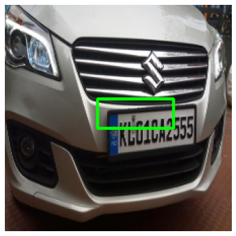

# PlateLocator

Finds the license plate in a photo of a car and draws a box around it. It's a VGG16 backbone with a small regression head, plus a Streamlit app for trying it on your own images.



## How it works

Plate detection is treated as regression instead of using an off-the-shelf detector like YOLO. The network looks at one image and predicts four numbers, the box corners as fractions of the image size.

```
Car image (224x224x3)
        |
VGG16 convolutional base (ImageNet weights, frozen)
        |
Flatten -> Dense 128 -> Dense 128 -> Dense 64
        |
Dense 4, sigmoid
        |
[xmin, ymin, xmax, ymax] in 0-1  ->  scaled back to pixels, box drawn on the original
```

Training details:

- **Data:** 433 images with Pascal VOC XML annotations. Each box is divided by the original image width and height, so it lands in the 0-1 range whatever the photo size.
- **Split:** about 81% train, 9% validation, 10% test (44 images), with fixed seeds.
- **Loss:** mean squared error with Adam. Early stopping on validation loss, patience 5.
- **Baseline:** a small two-block CNN (64 and 32 filters) trained from scratch, to see how much the pretrained backbone helps.
- **Optional:** `--finetune` unfreezes VGG16's last block and trains it a bit more at a low learning rate.

There is no confidence score. The model always returns exactly one box, so an image with no plate still gets one.

## Where this came from

I started from the "Car License Plate Detection Using Deep Learning | CNN & VGG16" tutorial by AI with Noor on YouTube, then rebuilt it. The tutorial gets you a working model and app. Running it carefully turned up several problems, listed next, and fixing them is what this repo is about.

## What I changed

1. **Accuracy was the wrong metric.** The notebook reports an "accuracy" of about 73% on the test set. With four coordinate outputs, Keras' `accuracy` is a classification metric and says nothing about how well the box fits the plate. I replaced it with IoU (intersection over union) and report mean IoU plus the share of test images above 0.5 and 0.75.
2. **Labels were stored in the wrong order.** The annotation function returned `[xmax, ymax, xmin, ymin]`, but the inference code read the output as `xmin, ymin, xmax, ymax`. It only looked fine because OpenCV accepts any two opposite corners. The order is now the same everywhere.
3. **Training and the app used different color orders.** Training used `cv2.imread` (BGR) and the app used PIL (RGB), then swapped channels again for display. Everything now goes through one `preprocess()` function in `src/data.py`, in RGB, with the standard VGG16 preprocessing.
4. **PNGs with an alpha channel crashed the app.** Images are converted to RGB on load.
5. **Images were matched to annotations by sort order.** Now each XML's own `filename` field is used. If an image has several plates, the largest box is used.
6. **Smaller fixes.** `VGG16` was used without being imported. Coordinates were cast to `int` before training, losing precision. The model was reloaded on every Streamlit rerun and is now cached. Weights save as `.keras` instead of `.h5`.

## Results

Validation MSE at the end of training, from the notebook run:

| Model | Val MSE |
|---|---|
| Small CNN from scratch | 0.0182 |
| VGG16 (frozen) + dense head | 0.0100 |

Pretrained features cut the validation error nearly in half, which makes sense with only 433 images. The run never measured IoU. After training with this repo, `python -m src.evaluate` prints it and saves a green-vs-red comparison to `assets/results/test_predictions.png`.

The sample predictions in `assets/results/` come from the notebook run. The weights file is large (VGG16 alone is around 60 MB), so it is not committed.

## Setup

```bash
git clone https://github.com/Sayanjones/car-plate-detection.git
cd car-plate-detection
python -m venv .venv && source .venv/bin/activate
pip install -r requirements.txt
```

### Dataset

Download [Car Plate Detection](https://www.kaggle.com/datasets/andrewmvd/car-plate-detection) from Kaggle and unzip it so you have:

```
data/
  images/        Cars0.png ... Cars432.png
  annotations/   Cars0.xml ... Cars432.xml
```

With the Kaggle CLI: `kaggle datasets download -d andrewmvd/car-plate-detection -p data --unzip`. Check the dataset page for its license before reusing it.

## Usage

Train (fast on a GPU, slow on CPU because of VGG16):

```bash
python -m src.train --data-dir data
python -m src.train --data-dir data --finetune
```

Evaluate on the held-out test split:

```bash
python -m src.evaluate --data-dir data
```

Detect a plate in one image:

```bash
python -m src.predict assets/samples/Cars114.png
```

Run the app:

```bash
streamlit run app.py
```

The app needs `models/car_plate_detector.keras`, which `src.train` creates. It shows the original image, the image with the box, and a crop of the detected plate.

## Project layout

```
app.py               Streamlit app
src/data.py          loading, preprocessing, train/val/test split
src/model.py         VGG16 + head, IoU metric
src/train.py         training and optional fine-tuning
src/evaluate.py      IoU on the test split + prediction grid
src/predict.py       detector class used by the app and the CLI
notebooks/           the original Kaggle notebook, kept for reference
assets/              sample images and result figures
```

## Limitations

- One box per image, always. There is no "no plate found" case.
- 433 training images, mostly clear and close-up. Expect worse results at night, at steep angles, or on distant cars.
- It locates plates but does not read them. Reading the text would need OCR on the cropped plate.

## Next steps

- Augmentation that moves the box with the image (flips, shifts, scale).
- An IoU-based loss instead of MSE, since MSE doesn't directly care about overlap.
- OCR on the crop to read the plate text.
- A YOLO baseline for comparison.

## Credits

Dataset by andrewmvd on Kaggle. Original approach from the AI with Noor tutorial linked above.

MIT licensed, see `LICENSE`.
